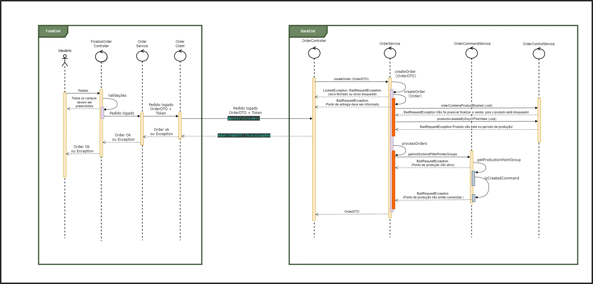

# Documentação do webApp pedidoApp

O pedidoApp é um sistema web voltado para gestão de pedidos e pagamentos, ideal para estabelecimentos como bares e restaurantes. Ele oferece diversas funcionalidades para facilitar o processo de pedido e pagamento.

## Funcionalidades

- **Pedido de Produtos:** Permite que clientes façam pedidos de produtos diretamente pelo aplicativo, facilitando o processo de escolha e solicitação.

- **Compra de Créditos:** Funcionalidade que permite aos usuários comprarem créditos pré-pagos, proporcionando conveniência e agilidade no processo de pagamento.

- **Pagamento de Compras em Aberto (Pós-pago):** Facilita o pagamento de contas pós-pagas, proporcionando flexibilidade aos clientes e estabelecimentos.

- **Utilização por Garçom:** Pode ser utilizado por garçons para realizar pedidos, facilitando o atendimento e melhorando a experiência do cliente.

- **Sistema de Pagamento Integrado com API da Cielo:** Integração com a API de pagamento da Cielo, permitindo pagamentos seguros e eficientes através de diversas modalidades como PIX, cartão de crédito e débito.

## Benefícios

- **Facilidade de Uso:** Interface intuitiva que simplifica o processo de pedidos e pagamentos.

- **Segurança:** Pagamentos seguros com integração robusta com a API da Cielo.

- **Flexibilidade:** Adaptável para diferentes tipos de estabelecimentos, como bares e restaurantes.

Este documento serve como guia inicial para entender as principais funcionalidades e benefícios do pedidoApp. Para mais detalhes sobre como configurar e utilizar o sistema, consulte a documentação completa disponível no repositório `pedidoApp-docs`. Para mais informações visite nosso site [Inloc Sistemas.](https://inlocsistemas.com.br/) 

# Regras de Negócio do Sistema

Para que um pedido seja concluído com sucesso, as seguintes regras de negócio devem ser seguidas:

## Regras de Negócio - Pedido

- Todos os campos na tela devem estar preenchidos.

- O **caixa do operador no WebApp deve estar aberto**; caso contrário, a API retornará (`LockedException`, caixa fechado).

- Deve ser um **sócio válido e não bloqueado**; se não for, a API retornará (`LockedException`, sócio bloqueado).

- O **ponto de entrega deve ser informado**; caso contrário, a API retornará (`BadRequestException`, Ponto de entrega deve ser informado).

- O **pedido não deve conter produtos bloqueados**; caso contrário, a API retornará (`BadRequestException`, Não foi possível finalizar a venda, pois o produto xpto está bloqueado!).

- O **pedido não deve conter produtos que estejam fora do período de produção**; caso contrário, a API retornará (`BadRequestException`, Produto xpto não está no período de produção!).

- O **pedido não deve conter produtos que estejam em um ponto de produção inativo**; caso contrário, a API retornará (`BadRequestException`, Produto xpto não possui um ponto de produção ativo no momento).

- O **pedido não deve conter itens se o ponto de produção estiver configurado para emitir tickets**; caso contrário, a API retornará (`BadRequestException`, Ponto de produção xpto não emite comandas).

### Diagrama de sequência

# Documentação APIs da Cielo - Cartão

## Fluxo pedido com Cartão de débito
Criação de um pedido e cobrança no cartão de débito.
- Diagrama de sequência (Débito)

## Fluxo pedido com cartão de crédito
Criação de um pedido e cobrança no cartão de crédito.
- Diagrama de sequência (Crédito)

# Documentação APIs da Cielo - Pix
Criação de um pedido e cobrança no Pix.
- Diagrama de sequência (Pix)
