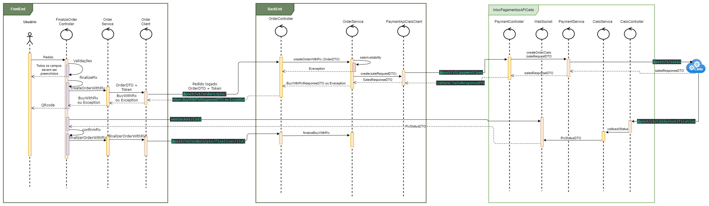

[](https://inlocsistemas.com.br)

# Documentação do webApp pedidoApp

O pedidoApp é um sistema web voltado para gestão de pedidos e pagamentos, ideal para estabelecimentos como bares e restaurantes. Ele oferece diversas funcionalidades para facilitar o processo de pedido e pagamento.

## Funcionalidades

- **Pedido de Produtos:** Permite que clientes façam pedidos de produtos diretamente pelo aplicativo, facilitando o processo de escolha e solicitação.

- **Compra de Créditos:** Funcionalidade que permite aos usuários comprarem créditos pré-pagos, proporcionando conveniência e agilidade no processo de pagamento.

- **Pagamento de Compras em Aberto (Pós-pago):** Facilita o pagamento de contas pós-pagas, proporcionando flexibilidade aos clientes e estabelecimentos.

- **Utilização por Garçom:** Pode ser utilizado por garçons para realizar pedidos, facilitando o atendimento e melhorando a experiência do cliente.

- **Sistema de Pagamento Integrado com API da Cielo:** Integração com a API de pagamento da Cielo, permitindo pagamentos seguros e eficientes através de diversas modalidades como PIX, cartão de crédito e débito.

## Benefícios

- **Facilidade de Uso:** Interface intuitiva que simplifica o processo de pedidos e pagamentos.

- **Segurança:** Pagamentos seguros com integração robusta com a API da Cielo.

- **Flexibilidade:** Adaptável para diferentes tipos de estabelecimentos, como bares e restaurantes.

Este documento serve como guia inicial para entender as principais funcionalidades e benefícios do pedidoApp. Para mais detalhes sobre como configurar e utilizar o sistema, consulte a documentação completa disponível no repositório `pedidoApp-docs`. Para mais informações visite nosso site [Inloc Sistemas.](https://inlocsistemas.com.br/) 

# Regras de Negócio do Sistema

Para que um pedido seja concluído com sucesso, as seguintes regras de negócio devem ser seguidas:

## Regras de Negócio - Pedido

- Todos os campos na tela devem estar preenchidos.

- O **caixa do operador no WebApp deve estar aberto**; caso contrário, a API retornará (`LockedException`, caixa fechado).

- Deve ser um **sócio válido e não bloqueado**; se não for, a API retornará (`LockedException`, sócio bloqueado).

- O **ponto de entrega deve ser informado**; caso contrário, a API retornará (`BadRequestException`, Ponto de entrega deve ser informado).

- O **pedido não deve conter produtos bloqueados**; caso contrário, a API retornará (`BadRequestException`, Não foi possível finalizar a venda, pois o produto xpto está bloqueado!).

- O **pedido não deve conter produtos que estejam fora do período de produção**; caso contrário, a API retornará (`BadRequestException`, Produto xpto não está no período de produção!).

- O **pedido não deve conter produtos que estejam em um ponto de produção inativo**; caso contrário, a API retornará (`BadRequestException`, Produto xpto não possui um ponto de produção ativo no momento).

- O **pedido não deve conter itens se o ponto de produção estiver configurado para emitir tickets**; caso contrário, a API retornará (`BadRequestException`, Ponto de produção xpto não emite comandas).

### Diagrama de sequência


# Documentação APIs da Cielo - Cartão

### Documentação das APIs da Cielo - Cartão

#### Fluxo de Pedido com Cartão de Débito

Este documento descreve como criar um pedido e realizar cobranças utilizando cartões de débito na plataforma da Cielo. Todos os campos devem ser preenchidos corretamente para garantir o funcionamento adequado do processo.

1. **Inicialização da Requisição do Token 3DS:**

   O método `prepareProcessDebitCard` é utilizado para iniciar a requisição do token 3DS.

   ```java
   public String prepareProcessDebitCard() {
       try {
           // Outros métodos
           if (this.validate()) {
               this.debitCardToken = this.paymentCardService.create3DSToken();
               this.preparedDebitCard = true;
           }
           return "";
       } catch (Exception e) {
           e.printStackTrace(); // Gerar log
           showErrorMessage("Erro", "Erro ao finalizar pedido, tente novamente!");
           return "";
       }
   }
   ```

2. **Criação do 3DS-Token:**

   Para criar o 3DS-Token, é feita uma chamada para o endpoint `@get/v1/payment-cards/3ds-token` na `pedidoAppApi`, que por sua vez requisita à `pagamentosApiCIELO` (`@get/v1/card/3ds-token`) um token para autenticação da transação na Cielo.

3. **Autenticação da Transação:**

   Após a criação do 3DS-Token, é necessário chamar a API de autenticação da Cielo para validar os dados através do [Script Cielo](https://developercielo.github.io/manual/3ds#integra%C3%A7%C3%A3o-do-script).

4. **Finalização do Pedido com Cartão de Débito:**

   O método `finalizeDebitCard` é utilizado para concluir o pedido após a autenticação 3DS e receber os parâmetros necessários:

   ```java
   public String finalizeDebitCard() {
       try {
           this.preparedDebitCard = false;

           String cavv = null;
           String xid = null;
           String eci = null;
           String version = null;
           String referenceId = null;

           Map<String, String> requestParamMap = FacesContext.getCurrentInstance().getExternalContext()
                   .getRequestParameterMap();

           // Verificação dos parâmetros retornados
           // ...

           this.orderService.createOrderWithCard(...); // 

           CheckOrderController.getBean().clearOrder();
           showInfoMessage("Sucesso", "Pedido finalizado com sucesso!");
           return MenuController.URL;
       } catch (ClientException e) {
           // Tratamento de exceções
           // ...
       } catch (Exception e) {
           e.printStackTrace(); // Gerar log
           showErrorMessage("Erro", "Erro ao finalizar pedido, tente novamente!");
       }
       return "";
   }
   ```

5. **Processamento da Transação com a Cielo:**

   O método `processCieloTransactionCard` é responsável por enviar os dados do pedido para processamento através da API da Cielo e verificar o status da transação:

   ```java
   processCieloTransactionCard(...) {
       try {
           saleResponse = this.paymentApiCieloClient.create(saleRequestDTO);

           // Verificação do status do pagamento
           if (saleResponse.getPayment().getStatus() == 2) {
               // Processo de sucesso
           } else if (saleResponse.getPayment().getStatus() == 3) {
               throw new UnauthorizedException("Pagamento negado por Autorizador!");
           } else if (saleResponse.getPayment().getStatus() == 13) {
               throw new UnprocessableEntityException("Pagamento cancelado por falha no processamento ou por ação do Antifraude!");
           } else {
               throw new InternalServerException("Erro ao processar pagamento!");
           }
       } catch (Exception e) {
           LOGGER.error("Erro ao conectar a API de pagamentos! " + e.getMessage());
           throw new InternalServerException("Erro ao conectar a API de pagamentos!");
       }
   }
   ```

### Diagrama de sequência Débito


## Fluxo pedido com cartão de crédito
A criação de um pedido e cobrança no cartão de crédito segue um fluxo semelhante ao do débito, porém não utiliza a implementação do 3D Secure.

### Diagrama de sequência Crédito


### Documentação APIs da Cielo - Pix

A seguir está o fluxo passo a passo para criação de um pedido e cobrança utilizando o meio de pagamento PIX.

1. **Iniciar Pedido com Pix**
   - O método `finalizePix` é chamado para iniciar o pedido do QR code do Pix.

   ```java
   public String finalizePix() {
       try {
           this.preparedPix = false;
           if (this.validate()) {
               BuyWithPix buyWithPix = this.orderService.createOrderWithPix(CheckOrderController.getBean().getOrder(),
                       this.deliveryPointId);
               // Verificação dos parâmetros retornados
               // ...
           }
       } catch (ClientException e) {
           if (e.getDetails() != null && !e.getDetails().isEmpty()) {
               e.getDetails().stream().forEach(it -> {
                   showErrorMessage("Erro", it);
               });
           } else {
               showErrorMessage("Erro", e.getMessage());
           }
       } catch (Exception e) {
           e.printStackTrace(); // GERAR LOG
           showErrorMessage("Erro", "Erro ao finalizar pedido, tente novamente!");
       }
       return "";
   }
   ```

2. **Requisição de Criação do Pedido**
   - O cliente faz uma requisição no **pedidoAppApi** no endpoint `@post/v1/orders/pix/`.

3. **Validação do Pedido**
   - O `saleAvailability` verifica se o pedido é válido e atende às [regras de negócio.](https://github.com/matheus-a1/pedidoapp-docs/blob/main/README.md#regras-de-neg%C3%B3cio---pedido)

4. **Criação do Pedido**
   - O método `create(saleRequestDTO)` faz a chamada do `PaymentApiCieloClient` para a API **InlocPagamentosAPICielo** no endpoint `@post/v1/payment/pay`.

5. **Processamento do Pedido na Cielo**
   - Na **InlocPagamentosAPICielo**, o `PaymentService` faz uma request `@post/1/sales` na **Cielo**, esperando uma `salesResponseDTO` como resposta.

6. **Resposta da Cielo**
   - A **Cielo** retorna o `SaleResponseDTO` para **InlocPagamentosAPICielo**, que por sua vez retorna para **pedidoAppApi**, e então os dados do Pix são enviados ao front end para o usuário realizar o pagamento.

7. **WebSocket para Atualização de Status**
   - Após a criação do QR code, um WebSocket é inicializado no **InlocPagamentosAPICielo** (`WebSocket/{id}`), aguardando uma mensagem de resposta.

8. **Notificação de Mudança de Status**
   - Quando há mudanças no status de uma transação, a **Cielo** faz um `@post/v1/cielo/notification` informando a mudança, que aciona o método `processPix` para retornar a resposta ao WebSocket com o `{id}` correspondente.

   ```java
   private void processPix(SaleResponseDTO saleResponse, CieloCallback cieloCallback) throws Exception {
       if (saleResponse.getPayment().getStatus() == 2) {
           this.pixProducer.sendStatus(
               cieloCallback.getTransactionId(),
               PixStatusDTO.builder()
                   .type(PixStatusDTO.Type.SUCCESS)
                   .build()
           );
       } else if (saleResponse.getPayment().getStatus() == 3) {
           this.pixProducer.sendStatus(
               cieloCallback.getTransactionId(),
               PixStatusDTO.builder()
                   .type(PixStatusDTO.Type.ERROR)
                   .message("Pagamento negado por Autorizador!")
                   .build()
           );
       } else if (saleResponse.getPayment().getStatus() == 13) {
           this.pixProducer.sendStatus(
               cieloCallback.getTransactionId(),
               PixStatusDTO.builder()
                   .type(PixStatusDTO.Type.ERROR)
                   .message("Pagamento cancelado por falha no processamento ou por ação do Antifraude!")
                   .build()
           );
       } else {
           this.pixProducer.sendStatus(
               cieloCallback.getTransactionId(),
               PixStatusDTO.builder()
                   .type(PixStatusDTO.Type.ERROR)
                   .message("Erro ao processar pagamento!")
                   .build()
           );
       }
   }
   ```

9. **Confirmação do Pedido**
   - O `PixStatusDTO` é enviado para o WebSocket com o `{id}` correspondente para finalizar o pedido através do `confirmPix`.

   ```java
   public String confirmPix() {
       try {
           if (this.statusPix.equals("SUCCESS")) {
               // finaliza pix 
               this.orderService.finalizerOrderWithPix(transactionIdPix);
               
               CheckOrderController.getBean().clearOrder();
               showInfoMessage("Sucesso", "Pedido finalizado com sucesso!");
               return MenuController.URL;
           } else {
               showErrorMessage("Erro", this.messagePix);
           }
           this.transactionIdPix = null;
           this.qrcodeBase64 = null;
           this.qrCode = null;
           this.preparedPix = false;
           this.statusPix = null;
           this.messagePix = null;
           
       } catch (ClientException e) {
           if (e.getDetails() != null && !e.getDetails().isEmpty()) {
               e.getDetails().stream().forEach(it -> {
                   showErrorMessage("Erro", it);
               });
           } else {
               showErrorMessage("Erro", e.getMessage());
           }		
       } catch (Exception e) {
           e.printStackTrace(); // GERAR LOG
           showErrorMessage("Erro", "Erro ao finalizar pedido, tente novamente!");
       }
       return "";
   }
   ```

10. **Finalização do Pedido**
    - Por fim, é chamado o método `finalizerOrderWithPix` no endpoint `@post/v1/orders/pix/finalizer/{id}`, concluindo assim o pedido.
    
### Diagrama de sequência (Pix)    

